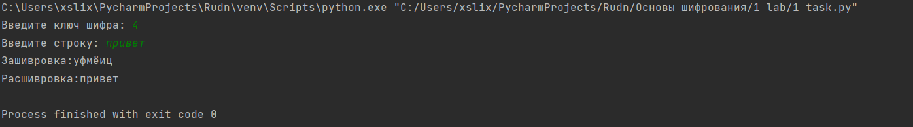
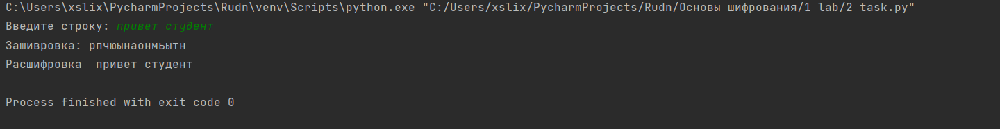

##                    РОССИЙСКИЙ УНИВЕРСИТЕТ ДРУЖБЫ НАРОДОВ

###            Факультет физико-математических и естественных наук

###            Кафедра прикладной информатики и теории вероятностей


###                                ОТЧЕТ

###                      по лабораторной работе №1

###           дисциплина: Математические основы защиты информации       


###                                                       Студент: Меньшов Иван                  


###                                                         Группа: Нпммд-02-21


###                                                  Преподаватель: Кулябов Д.С.                   


###                                МОСКВА

###                                2021 г.


# Цель работы

Изучение алгоритмов шифрования Цезаря и Атбаш

# Теоретические сведения

## Шифр Цезаря

Шифр Цезаря, также известный, как шифр сдвига, код Цезаря или сдвиг Цезаря — один из самых простых и наиболее широко известных методов шифрования.

Шифр Цезаря — это вид шифра подстановки, в котором каждый символ в открытом тексте заменяется символом находящимся на некотором постоянном числе позиций левее или правее него в алфавите. Например, в шифре со сдвигом 3 А была бы заменена на Г, Б станет Д, и так далее.

Шифр назван в честь римского императора Гая Юлия Цезаря, использовавшего его для секретной переписки со своими генералами.

Шаг шифрования, выполняемый шифром Цезаря, часто включается как часть более сложных схем, таких как шифр Виженера, и все ещё имеет современное приложение в системе ROT13. Как и все моноалфавитные шифры, шифр Цезаря легко взламывается и не имеет практически никакого применения на практике.

Если сопоставить каждому символу алфавита его порядковый номер (нумеруя с 0), то шифрование и дешифрование можно выразить формулами модульной арифметики:

```
y = (x + k) mod n
x = (y - k + n) mod n
```

где
*x — символ открытого текста,
*y — символ шифрованного текста
*n — мощность алфавита
*k — ключ.

С точки зрения математики шифр Цезаря является частным случаем аффинного шифра.

## Шифр Атбаш

Атбаш — простой шифр подстановки, изначально придуманный для иврита. Правило шифрования состоит в замене i-й буквы алфавита буквой с номером n − i + 1, где n — число букв в алфавите.

# Выполнение работы

## Реализация шифра Цезаря на языке Python

```
slovr = 'авгдеёжзийклмнопрстуфхцчшщъыьэюя '
k = int(input('Введите ключ шифра: '))
user_string = str(input('Введите строку: '))
new_string = ''
for i in range(len(user_string)):
    f_index = slovr.find(user_string[i])
    new_string += slovr[(k+f_index) % len(slovr)]
print(f'Зашивровка:{new_string}')

new_string1 = ''
for i in range(len(new_string)):
    f_index = slovr.find(new_string[i])
    new_string1 += slovr[(f_index-k) % len(slovr)]
print(f'Расшивровка:{new_string1}')
```

## Реализация шифра Атбаш на языке Python

```
slovr ='абвгдеёжзийклмнопрстуфхцчшщъыьэюя '
mix_slovr = slovr[::-1]
user_string = str(input('Введите строку: '))
new_string = ''
for i in range(len(user_string)):
    f_index = slovr.find(user_string[i])
    new_string += mix_slovr[f_index]
print('Зашивровка:', new_string)
new_string1 = ''
for i in range(len(new_string)):
    f_index = mix_slovr.find(new_string[i])
    new_string1 += slovr[f_index]
print('Расшифровка ', new_string1)
```

## Контрольный пример




# Выводы

Изучили алгоритмы шифрования Цезаря и Атбаш.

# Список литературы

1. [Шифр Цезаря](https://habr.com/ru/post/534058/)
2. [Шифр Атбаш](https://habr.com/ru/post/444176/)
