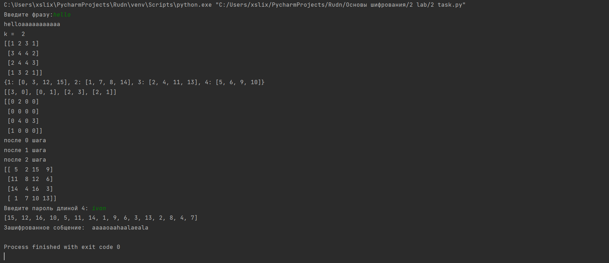

---
## Front matter
lang: ru-RU
title: Алгоритмы маршрутной перестановки, решеток и Виженера
author: Меньшов Иван Сергеевич
institute: Российский Университет Дружбы Народов
date: 20 ноября, 2021, Москва, Россия

## Formatting
mainfont: PT Serif
romanfont: PT Serif
sansfont: PT Sans
monofont: PT Mono
toc: false
slide_level: 2
theme: metropolis
header-includes: 
 - \metroset{progressbar=frametitle,sectionpage=progressbar,numbering=fraction}
 - '\makeatletter'
 - '\beamer@ignorenonframefalse'
 - '\makeatother'
aspectratio: 43
section-titles: true
---

# Цели и задачи

## Цель лабораторной работы

Изучение алгоритмов маршрутной перестановки, решеток и Виженера

# Выполнение лабораторной работы

## Шифр маршрутной перестановки

Широкое распространение получили шифры перестановки, использующие некоторую геометрическую фигуру. Преобразования из этого шифра состоят в том, что в фигуру исходный текст вписывается по ходу одного ``маршрута'', а затем по ходу другого выписывается с нее. Такой шифр называют маршрутной перестановкой. Например, можно вписывать исходное сообщение в прямоугольную таблицу, выбрав такой маршрут: по горизонтали, начиная с левого верхнего угла поочередно слева направо и справа налево. Выписывать же сообщение будем по другому маршруту: по вертикали, начиная с верхнего правого угла и двигаясь поочередно сверху вниз и снизу вверх.

## Шифр Кардано

Решётка Кардано — инструмент кодирования и декодирования, представляющий собой специальную прямоугольную (в частном случае — квадратную) таблицу-карточку, четверть ячеек которой вырезана.

Таблица накладывается на носитель, и в вырезанные ячейки вписываются буквы, составляющие сообщение. После переворачивания таблицы вдоль вертикальной оси, процесс вписывания букв повторяется. Затем то же самое происходит после переворачивания вдоль горизонтальной и снова вдоль вертикальной осей.

В частном случае квадратной таблицы, для получения новых позиций для вписывания букв, можно поворачивать квадрат на четверть оборота.

## Шифр Кардано

Чтобы прочитать закодированное сообщение, необходимо наложить решётку Кардано нужное число раз на закодированный текст и прочитать буквы, расположенные в вырезанных ячейках.

Такой способ шифрования сообщения был предложен математиком Джероламо Кардано в 1550 году, за что и получил своё название.

## Шифр Виженера

Шифр Виженера (фр. Chiffre de Vigenère) — метод полиалфавитного шифрования буквенного текста с использованием ключевого слова.

Этот метод является простой формой многоалфавитной замены. Шифр Виженера изобретался многократно. Впервые этот метод описал Джован Баттиста Беллазо (итал. Giovan Battista Bellaso) в книге La cifra del. Sig. Giovan Battista Bellasо в 1553 году, однако в XIX веке получил имя Блеза Виженера, французского дипломата. Метод прост для понимания и реализации, он является недоступным для простых методов криптоанализа.

## Шифр Виженера

В шифре Цезаря каждая буква алфавита сдвигается на несколько строк; например в шифре Цезаря при сдвиге +3, A стало бы D, B стало бы E и так далее. Шифр Виженера состоит из последовательности нескольких шифров Цезаря с различными значениями сдвига. Для зашифровывания может использоваться таблица алфавитов, называемая tabula recta или квадрат (таблица) Виженера. Применительно к латинскому алфавиту таблица Виженера составляется из строк по 26 символов, причём каждая следующая строка сдвигается на несколько позиций. Таким образом, в таблице получается 26 различных шифров Цезаря. На каждом этапе шифрования используются различные алфавиты, выбираемые в зависимости от символа ключевого слова.

## Контрольный пример 1

{ #fig:001 width=70% height=70%}

## Контрольный пример 2

{ #fig:002 width=70% height=70%}

## Контрольный пример 3

{ #fig:003 width=70% height=70%}

# Выводы

## Результаты выполнения лабораторной работы

Изучили алгоритмы шифрования с помощью перестановок