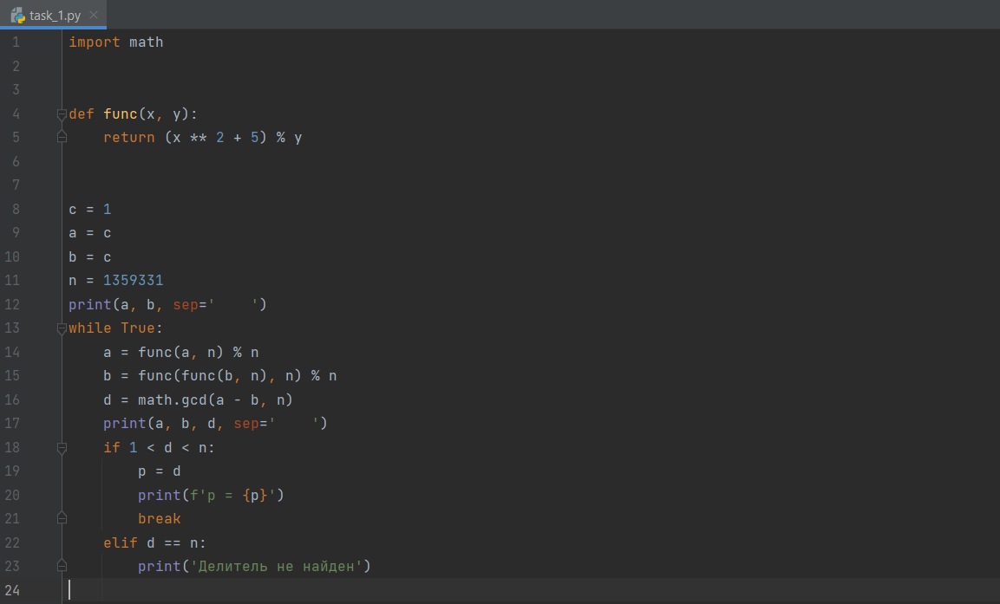
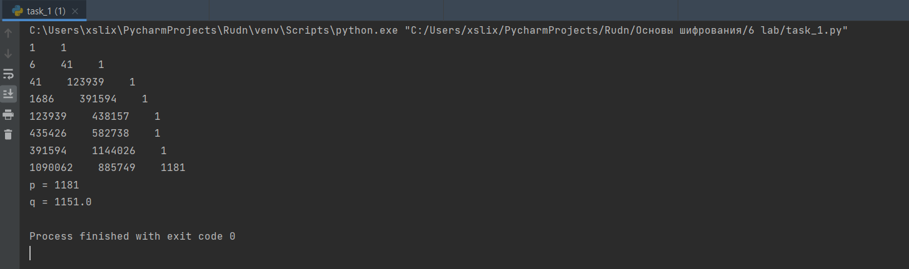

---
## Front matter
lang: ru-RU
title: Разложение чисел на множетели.Р - метод Полларда.
author: Меньшов Иван Сергеевич
institute: Российский Университет Дружбы Народов
date: 15 декабря, 2021, Москва, Россия

## Formatting
mainfont: PT Serif
romanfont: PT Serif
sansfont: PT Sans
monofont: PT Mono
toc: false
slide_level: 2
theme: metropolis
header-includes: 
 - \metroset{progressbar=frametitle,sectionpage=progressbar,numbering=fraction}
 - '\makeatletter'
 - '\beamer@ignorenonframefalse'
 - '\makeatother'
aspectratio: 43
section-titles: true
---

# Цели и задачи

## Цель лабораторной работы

Изучить разложение чисел на множетели. Реалезовать р - метод Полларда.

# Выполнение лабораторной работы

## Разложение чисел на множетели

Задача разложения на множители — одна из первых задач, использованных для построения криптосистем с открытым ключом.

Задача разложения составного числа на множители формулируется
следующим образом: для данного положительного целого числа n найти его
каноническое разложение $n = p^{a_1}_1  ... p^{a_n}_n ,$ где р~i~ — попарно различные простые
числа, a~i~ > 1.

На практике не обязательно находить каноническое разложение числа n.
Достаточно найти его разложение на два нетривиальных сомножителя: 
n = pq , 1<=р<=q<n. Далее будем понимать задачу разложения именно в этом смысле.

## P - метод Полларда

P - метод Полларда - алгоритм разработанный Джоном Поллардом для разлажения
числа n на множетели. Данный алгоритм выглядит следующим образом:	

Вход. Число n, начальное значение c , функция f, обладающая сжимающим свойством 

Выход. Нетривиальный делитель числа n.

1. Положить a = c , b = c

2. Вычислить a = f(a)(mod n) , b = f(f(b))(mod n)

3. Найти d = НОД(a - b, n)

4. Если 1 < d < n, то положить p = d и результат: p. При d = n результат:'Делитель не найден' .При d = 1 вернуться на шаг 2.

## Контрольные пример - код 

{ #fig:001 width=70% height=70%}

## Контрольные пример - работа программы 

{ #fig:002 width=70% height=70%}

# Выводы

## Результаты выполнения лабораторной работы

Мной было изучено разложение чисел на множетели, а также реализован р - метод Полларда.