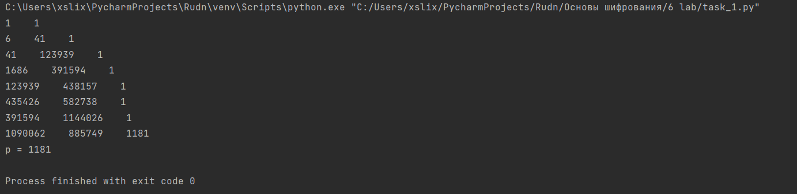

---
# Front matter
lang: ru-RU
title: "Математические основы защиты информации и информационной безопасности"
subtitle: "Отчет по лабораторной работе № 6"
author: "Меньшов Иван Сергеевич НПМмд-02-21"

# Formatting
toc-title: "Содержание"
toc: true # Table of contents
toc_depth: 2
lof: true # List of figures
fontsize: 12pt
linestretch: 1.5
papersize: a4paper
documentclass: scrreprt
polyglossia-lang: russian
polyglossia-otherlangs: english
mainfont: PT Serif
romanfont: PT Serif
sansfont: PT Sans
monofont: PT Mono
mainfontoptions: Ligatures=TeX
romanfontoptions: Ligatures=TeX
sansfontoptions: Ligatures=TeX,Scale=MatchLowercase
monofontoptions: Scale=MatchLowercase
indent: true
pdf-engine: lualatex
header-includes:
  - \linepenalty=10 # the penalty added to the badness of each line within a paragraph (no associated penalty node) Increasing the value makes tex try to have fewer lines in the paragraph.
  - \interlinepenalty=0 # value of the penalty (node) added after each line of a paragraph.
  - \hyphenpenalty=50 # the penalty for line breaking at an automatically inserted hyphen
  - \exhyphenpenalty=50 # the penalty for line breaking at an explicit hyphen
  - \binoppenalty=700 # the penalty for breaking a line at a binary operator
  - \relpenalty=500 # the penalty for breaking a line at a relation
  - \clubpenalty=150 # extra penalty for breaking after first line of a paragraph
  - \widowpenalty=150 # extra penalty for breaking before last line of a paragraph
  - \displaywidowpenalty=50 # extra penalty for breaking before last line before a display math
  - \brokenpenalty=100 # extra penalty for page breaking after a hyphenated line
  - \predisplaypenalty=10000 # penalty for breaking before a display
  - \postdisplaypenalty=0 # penalty for breaking after a display
  - \floatingpenalty = 20000 # penalty for splitting an insertion (can only be split footnote in standard LaTeX)
  - \raggedbottom # or \flushbottom
  - \usepackage{float} # keep figures where there are in the text
  - \floatplacement{figure}{H} # keep figures where there are in the text
---

# Цель работы

Изучить разложение чисел на множетели. Реалезовать р - метод Полларда.

# Теоретические сведения

## Разложение чисел на множетели

Задача разложения на множители — одна из первых задач, использованных для построения криптосистем с открытым ключом.

Задача разложения составного числа на множители формулируется
следующим образом: для данного положительного целого числа n найти его
каноническое разложение $n = p^{a_1}_1  ... p^{a_n}_n ,$ где р~i~ — попарно различные простые
числа, a~i~ > 1.

На практике не обязательно находить каноническое разложение числа n.
Достаточно найти его разложение на два нетривиальных сомножителя: 
n = pq , 1<=р<=q<n. Далее будем понимать задачу разложения именно в этом смысле.
 


## P - метод Полларда

P - метод Полларда - алгоритм разработанный Джоном Поллардом для разлажения
числа n на множетели. Данный алгоритм выглядит следующим образом:	

Вход. Число n, начальное значение c , функция f, обладающая сжимающим свойством 

Выход. Нетривиальный делитель числа n.

1. Положить a = c , b = c

2. Вычислить a = f(a)(mod n) , b = f(f(b))(mod n)

3. Найти d = НОД(a - b, n)

4. Если 1 < d < n, то положить p = d и результат: p. При d = n результат:'Делитель не найден' .При d = 1 вернуться на шаг 2.

# Выполнение работы

## Реализация алгоритма на языке Python

*P - метод Полларда*

```
import math


def func(x, y):
    return (x ** 2 + 5) % y


c = 1
a = c
b = c
n = 1359331
print(a, b, sep='    ')
while True:
    a = func(a, n) % n
    b = func(func(b, n), n) % n
    d = math.gcd(a - b, n)
    print(a, b, d, sep='    ')
    if 1 < d < n:
        p = d
        print(f'p = {p}')
        break
    elif d == n:
        print('Делитель не найден')
```


## Контрольный пример

{ #fig:001 width=70% height=70%}

# Выводы

Мной было изучено разложение чисел на множетели, а также реализован р - метод Полларда.

# Список литературы{.unnumbered}

1. [Инструкция к лабораторной работе №6](https://esystem.rudn.ru/pluginfile.php/1283459/mod_folder/content/0/lab06.pdf?forcedownload=1)

