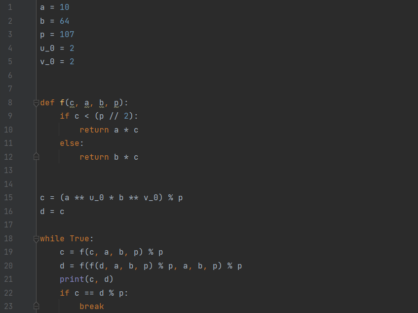
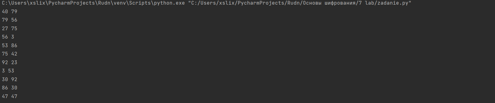

---
## Front matter
lang: ru-RU
title: P-метод Полларда для задач дискретного логорифмирования.
author: Меньшов Иван Сергеевич
institute: Российский Университет Дружбы Народов
date: 24 декабря, 2021, Москва, Россия

## Formatting
mainfont: PT Serif
romanfont: PT Serif
sansfont: PT Sans
monofont: PT Mono
toc: false
slide_level: 2
theme: metropolis
header-includes: 
 - \metroset{progressbar=frametitle,sectionpage=progressbar,numbering=fraction}
 - '\makeatletter'
 - '\beamer@ignorenonframefalse'
 - '\makeatother'
aspectratio: 43
section-titles: true
---

# Цель работы

Изучить алгоитм реализующий P-метод Полларда для задач дискретного логорифмирования.

# Выполнение лабораторной работы

##  P-метод Полларда для задач дискретного логорифмирования

Вход: Простое число p, число а порядка r по модулю р, целое число b, 1 < b <p;
отображение f, обладающее сжимающими свойствами и сохраняющее
вычислимость логарифма.

Выход. Показатель x, для которого а^x^  = b (mod p), если такой показатель существует.

##  P-метод Полларда для задач дискретного логорифмирования

1. Выбрать произвольные целые числа u, v и положить с = а^u^ b^v^ (mod p), d = с.

2. Выполнять с = f(c)(mod p), d = f(f(d))(mod p), вычисляя при этом
логарифмы для с и d как линейные функции от х по модулю r, до получения
равенства с = d (mod p).

3. Приравняв логарифмы для c и d, вычислить логарифм х решением сравнения по модулю r. Результат: х или "Решений нет"

## Контрольные пример - код 

{ #fig:001 width=70% height=70%}

## Контрольные пример - работа программы 

{ #fig:002 width=70% height=70%}

# Выводы

## Результаты выполнения лабораторной работы

Мной было изучен алгоитм реализующий P-метод Полларда для задач дискретного логорифмирования. К сожаленю данный алгоритм нуждается в доработке - этот вывод был сделан преподавателем на семинаре.