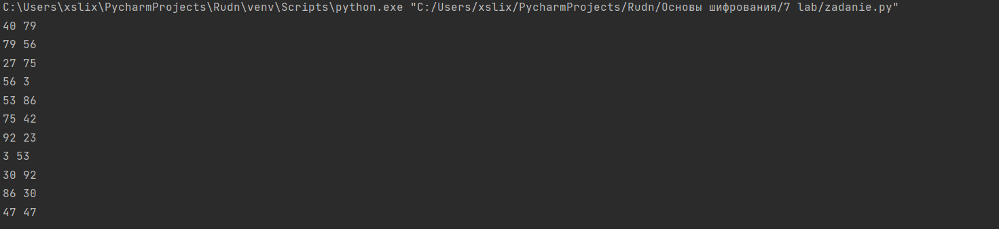

---
# Front matter
lang: ru-RU
title: "Математические основы защиты информации и информационной безопасности"
subtitle: "Отчет по лабораторной работе № 7"
author: "Меньшов Иван Сергеевич НПМмд-02-21"

# Formatting
toc-title: "Содержание"
toc: true # Table of contents
toc_depth: 2
lof: true # List of figures
fontsize: 12pt
linestretch: 1.5
papersize: a4paper
documentclass: scrreprt
polyglossia-lang: russian
polyglossia-otherlangs: english
mainfont: PT Serif
romanfont: PT Serif
sansfont: PT Sans
monofont: PT Mono
mainfontoptions: Ligatures=TeX
romanfontoptions: Ligatures=TeX
sansfontoptions: Ligatures=TeX,Scale=MatchLowercase
monofontoptions: Scale=MatchLowercase
indent: true
pdf-engine: lualatex
header-includes:
  - \linepenalty=10 # the penalty added to the badness of each line within a paragraph (no associated penalty node) Increasing the value makes tex try to have fewer lines in the paragraph.
  - \interlinepenalty=0 # value of the penalty (node) added after each line of a paragraph.
  - \hyphenpenalty=50 # the penalty for line breaking at an automatically inserted hyphen
  - \exhyphenpenalty=50 # the penalty for line breaking at an explicit hyphen
  - \binoppenalty=700 # the penalty for breaking a line at a binary operator
  - \relpenalty=500 # the penalty for breaking a line at a relation
  - \clubpenalty=150 # extra penalty for breaking after first line of a paragraph
  - \widowpenalty=150 # extra penalty for breaking before last line of a paragraph
  - \displaywidowpenalty=50 # extra penalty for breaking before last line before a display math
  - \brokenpenalty=100 # extra penalty for page breaking after a hyphenated line
  - \predisplaypenalty=10000 # penalty for breaking before a display
  - \postdisplaypenalty=0 # penalty for breaking after a display
  - \floatingpenalty = 20000 # penalty for splitting an insertion (can only be split footnote in standard LaTeX)
  - \raggedbottom # or \flushbottom
  - \usepackage{float} # keep figures where there are in the text
  - \floatplacement{figure}{H} # keep figures where there are in the text
---

# Цель работы

Изучить алгоитм реализующий P-метод Полларда для задач дискретного логорифмирования.

# Теоретические сведения

##  P-метод Полларда для задач дискретного логорифмирования

Вход: Простое число p, число а порядка r по модулю р, целое число b, 1 < b <p;
отображение f, обладающее сжимающими свойствами и сохраняющее
вычислимость логарифма.

Выход. Показатель x, для которого а^x^  = b (mod p), если такой показатель существует.

1. Выбрать произвольные целые числа u, v и положить с = а^u^ b^v^ (mod p), d = с.

2. Выполнять с = f(c)(mod p), d = f(f(d))(mod p), вычисляя при этом
логарифмы для с и d как линейные функции от х по модулю r, до получения
равенства с = d (mod p).

3. Приравняв логарифмы для c и d, вычислить логарифм х решением сравнения по модулю r. Результат: х или "Решений нет"

# Выполнение работы

## Реализация алгоритма на языке Python


```
a = 10
b = 64
p = 107
u_0 = 2
v_0 = 2


def f(c, a, b, p):
    if c < (p // 2):
        return a * c
    else:
        return b * c


c = (a ** u_0 * b ** v_0) % p
d = c

while True:
    c = f(c, a, b, p) % p
    d = f(f(d, a, b, p) % p, a, b, p) % p
    print(c, d)
    if c == d % p:
        break
		
```


## Контрольный пример

{ #fig:001 width=70% height=70%}

# Выводы

Мной было изучен алгоитм реализующий P-метод Полларда для задач дискретного логорифмирования. К сожаленю данный алгоритм нуждается в доработке - этот вывод был сделан преподавателем на семинаре.

# Список литературы{.unnumbered}

1. [Инструкция к лабораторной работе №7](https://esystem.rudn.ru/pluginfile.php/1283466/mod_folder/content/0/lab07.pdf?forcedownload=1)

